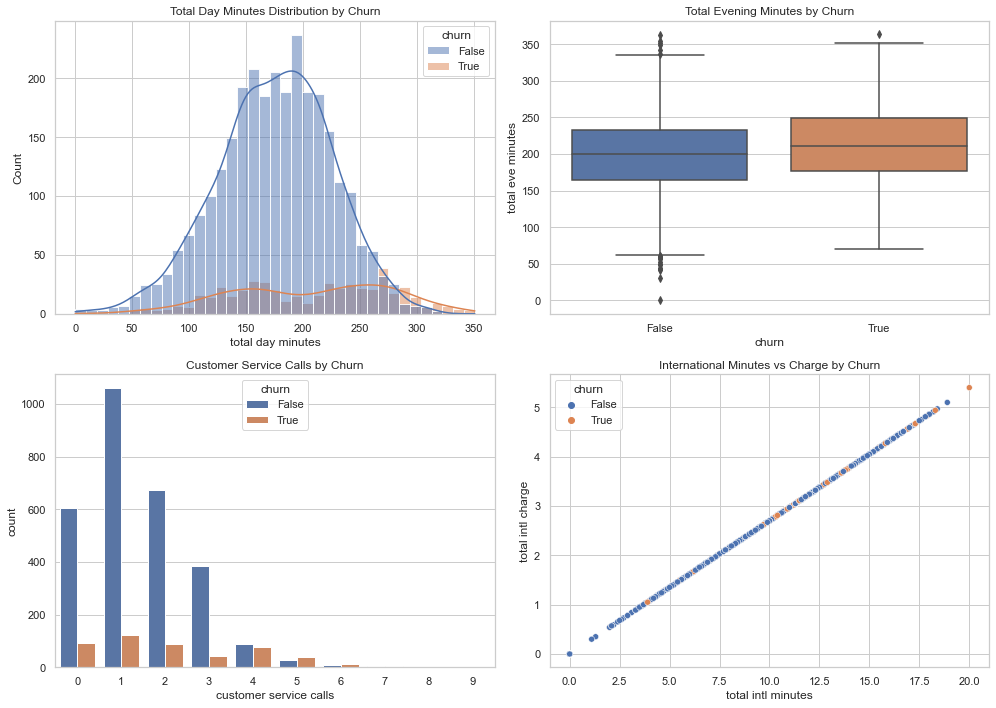
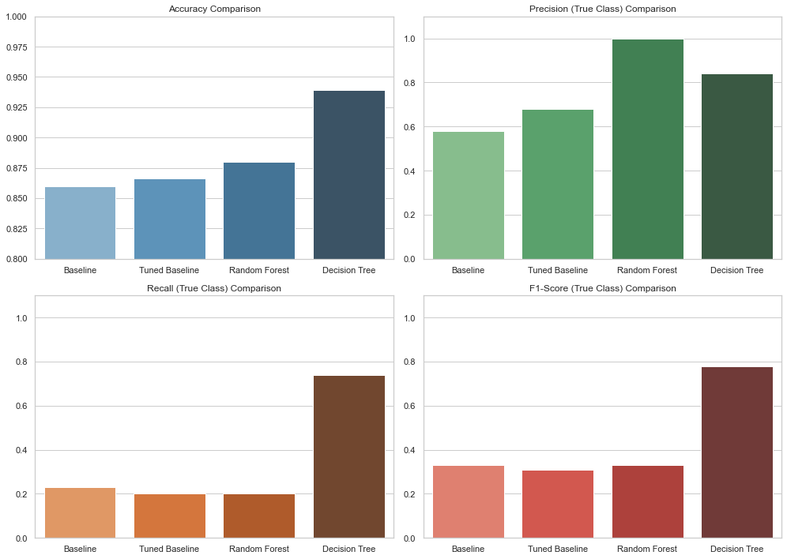

# Customer Churn Prediction for SyriaTel

## Project Overview

This project aims to predict customer churn for SyriaTel, a telecommunications company. By identifying customers who are likely to leave the service, the company can take proactive steps to retain them, thus reducing churn rates and improving overall customer satisfaction.

## Table of Contents

1. [Introduction](#introduction)
2. [Data Description](#data-description)
3. [Modeling Approach](#modeling-approach)
4. [Model Evaluation](#model-evaluation)
5. [Findings and Recommendations](#findings-and-recommendations)
6. [Conclusion](#conclusion)
7. [Visualizations](#visualizations)
8. [Non-Technical Presentation](#non-technical-presentation)

## Introduction

Customer churn is a critical problem for businesses, especially in highly competitive industries like telecommunications. The goal of this project is to develop a predictive model that can accurately identify customers who are likely to churn, allowing the company to implement targeted retention strategies.

## Data Description

The data used for this project is sourced from a telecom customer churn dataset, which can be found on Kaggle. You can access the dataset [here](https://www.kaggle.com/datasets/becksddf/churn-in-telecoms-dataset?resource=download). The dataset provided includes various customer attributes such as account length, area code, number of customer service calls, and whether the customer churned or not. The data was preprocessed to handle missing values, categorical features, and class imbalance.

## Modeling Approach

I explored several models to predict customer churn:

1. **Baseline Model**: A Logistic Regression model was used as the baseline.
2. **Tuned Baseline Model**: Hyperparameter tuning was applied to improve the baseline model.
3. **Random Forest Model**: A complex model with a large number of trees to capture interactions among features.
4. **Decision Tree Model**: A simpler, interpretable model that performed best in our tests.

### Model Comparison

- **Baseline Model**: Accuracy = 86.00%
- **Tuned Baseline Model**: Accuracy = 86.63%
- **Random Forest Model**: Accuracy = 88.02%
- **Decision Tree Model**: Accuracy = 93.93%

## Model Evaluation

The Decision Tree model was selected as the best model based on its superior accuracy and balanced performance across all evaluation metrics, especially in identifying true churn cases. 

### Key Metrics:
- **Precision**: Indicates the proportion of true churn cases among those predicted as churn.
- **Recall**: Measures the model's ability to identify all actual churn cases.
- **F1-Score**: A balance between precision and recall, providing a single metric that considers both false positives and false negatives.

## Findings and Recommendations

### Key Findings

- **Decision Tree Performance**: The Decision Tree model demonstrated the highest accuracy (93.93%) and a well-balanced trade-off between precision and recall, making it the most reliable model for predicting churn.
- **Importance of Model Selection**: Simpler models like Decision Trees can sometimes outperform more complex models like Random Forests, especially when computational efficiency and interpretability are considered.

### Recommendations

- **Proactive Retention Strategies**: Focus on the customers predicted to churn by the Decision Tree model. Tailored retention offers and personalized communication could significantly reduce churn rates.
- **Continuous Monitoring**: The model should be updated regularly with new data to ensure its predictions remain accurate over time.

### Next Steps

- **Feature Engineering**: Explore additional features that may improve model performance.
- **Model Deployment**: Implement the Decision Tree model in a live environment to test its real-world effectiveness.
- **Further Model Tuning**: Consider advanced techniques like ensemble methods or deep learning if performance improvements are necessary.

## Conclusion

### Summary

This project successfully identified a model that can predict customer churn with high accuracy. The Decision Tree model emerged as the most effective tool for this task, providing a balance between performance and interpretability.

### Lessons Learned

- **Model Simplicity**: Simpler models can sometimes provide better performance and easier interpretation.
- **Data Quality**: The success of any predictive model depends heavily on the quality and relevance of the input features.

### Acknowledgments

- **Data Source**: Thanks to SyriaTel for providing the dataset.
- **Team Support**: Appreciation for the team and mentors who guided the project.

## Visualizations

1. **Visualization of Key Features**:
   

2. **Model Comparison Plot**:
   

3. **Distribution of Categorical Features**:
   

## Non-Technical Presentation

For a concise summary of the project and its business implications, please view the non-technical presentation [here](Presentation.pdf).
